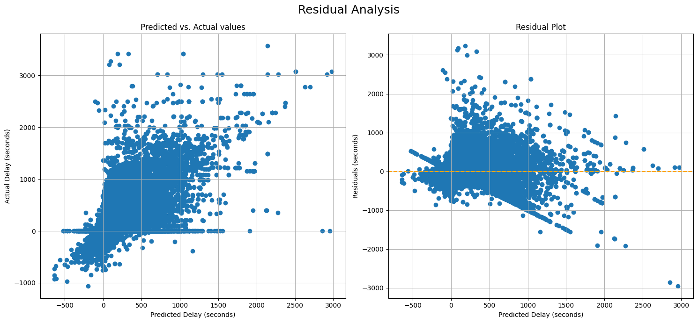

# STM Transit Delay Prediction

## Introduction

The _Société de transport de Montréal_ (STM) is Montreal’s public transport agency. The network contains four subway lines and 235 bus routes. The STM is one of the biggest transit systems in Canada and North America. Predicting these delays not only helps passengers plan their journeys more effectively but also enables STM to optimize scheduling and resource allocation.

## Description

The objective of this project is to build a machine learning model that predicts the STM transit delays in seconds with the best accuracy.

## Dataset

### Source

The data comes from three different sources:

- [STM Website](https://www.stm.info/en/info/networks/bus): Route types through web scraping.
- [STM General Transit Feed Specification (GTFS)](https://www.stm.info/en/about/developers): Real-time trip updates and schedules.
- [Open-Meteo API](https://open-meteo.com/en/docs): Weather archive and forecast.

### Description

- The cleaned dataset contains a total of 7,530,892 rows and 27 columns.
- Here are some of the key features collected:
  - `rt_arrival_time`, `rt_departure_time`: Real-time arrival and departure time
  - `sch_arrival_time`, `sch_departure_time`: Scheduled arrival and departure time
  - `stop_sequence`: Sequence of a stop, for ordering
  - `stop_lat`, `stop_lon`: Stop coordinates
  - `temperature_2m`: Air temperature at 2 meters above ground
  - `relative_humidity_2m`: Relative humidity at 2 meters above ground
  - `wind_direction_10m`: Wind direction at 10 meters above ground
  - `wind_speed_10m`: Wind speed at 10 meters above ground

## Methods & Models

### Data Preprocessing

- There were extreme delay outliers of less than -10000 seconds and more than 50000 seconds, which have been removed.
- Due to the large volume of data, half of the dataset has been used as historical data. The other half was used for data modeling.
- The categorial features have been encoded with One-Hot Encoding.
- The stop coordinated have been grouped with K-Means clustering.

### Feature Engineering

- Temporal features were created like `day_of_week`, `time_of_day`, `is_week_end` and `is_peak_hour`.
- With the historical data, the average delay per stop per hour was calculated.
- Other trip-based featured have been created like `trip_progression`, `exp_trip_duration` (expected trip duration), `stop_distance` (from previous stop), `arrivals_per_hour` and `route_bearing`.

### Data splitting

- The train-validation-test split was 80-10-10.
- To save computation time, 25% of the train set has been used for experimenting and the full train size was used for the final model.

### Models Tested

The following tree-based regression models have been tested in this project: **XGBoost**, **LightGBM** and **CatBoost**. They have been selected because they work great for high-cardinality, non-linear and mixed data. Also, they have a shorter fitting time for large datasets.

### Hyperparameter Tuning

Due to the large volume data, a Randomized Search was performed with a 2-Fold Cross-Validation instead of a Grid Search.

### Evaluation Metrics

- Mean Average Error (MAE)
- Root Mean Squared Error (RMSE)
- Coefficient of Determination (R²)
- Feature Importances
- SHapley Additive exPlanations (SHAP) analysis for interpretability

### Feature Optimization

- Polynomial feature have been generated and the best ones have been selected based on Mutual Information Regression.

## Results

### Metrics:

| Model    | MAE   | RMSE   | R²     |
| -------- | ----- | ------ | ------ |
| Baseline | 71.40 | 138.65 | 0.1959 |
| XGBoost  | 58.64 | 115.39 | 0.4526 |

### Key Visualizations:

- Residual plot analysis shows a consistent spread with minor variance on extreme values.
- Prediction vs. Actual plot demonstrates a good fit for typical delay ranges.
  
- Feature Importance analysis reveals that **historical delay** and **expected trip duration** are major predictors.
  

### Error Analysis:

- Underestimation during peak hours, likely due to unaccounted real-time traffic congestion and weather changes that impact transit flow.
- Overestimation in low-traffic periods suggests room for further temporal feature engineering.

### Model Interpretability:

- SHAP analysis indicates that **historical average delay** and **arrivals per hour** are the most influential features.
  

## Future Improvements

- Integrate real-time traffic and incident reports for enhanced delay prediction.
- Explore **stacked ensemble models** to leverage the strengths of multiple regressors.
- Implement **dynamic temporal clustering** to better capture varying traffic patterns throughout the day.
- Include more refined weather data granularity.
- Explore time-series and deep-learning models.
- Integrate events (concerts, festivals, sports events).
- Collect data all year round.
  - Other time-based features to add would be `month` and `is_holiday`.
- Insert the data into a database to optimize performance.

## Conclusion

This project successfully demonstrates the application of machine learning for predicting STM transit delays in real time. By leveraging historical transit data, weather information, and stop-level details, the XGBoost Regressor was able to achieve a **MAE of 58.64** and an **RMSE of 115.39**, significantly outperforming the baseline model. These results indicate that machine learning can serve as a powerful tool for optimizing public transit schedules and improving commuter experience.

The analysis identified key predictors such as **historical average delay**, **expected trip duration**, and **arrivals per hour** as the main drivers of delay, providing valuable insights into transit bottlenecks and congestion periods. Error analysis further revealed that model accuracy can be improved during peak hours and low-traffic periods, where predictions were slightly less accurate. This suggests that incorporating **real-time traffic feeds** and more granular **temporal features** could further enhance predictive performance.

Overall, this project not only highlights the feasibility of transit delay prediction but also sets a strong foundation for future enhancements that can benefit both STM operations and public transit users in Montreal.

## Featured Notebooks

- [Data Collection and Cleaning](./notebooks/data_cleaning.ipynb)
- [Data Preprocessing](./notebooks/data_preprocessing.ipynb)
- [Data Modeling](./notebooks/data_modeling.ipynb)

## Deployment

The STM Transit Delay Prediction model is deployed locally using a Flask API. This allows for real-time predictions of transit delays by making HTTP requests.

### How to Run:

1. **Clone the repository**

- Open your terminal or command prompt.
- Navigate to the directory where you want to install the project.
- Run the following command to clone the GitHub repository:
  ```bash
  git clone https://github.com/nadpierre/stm-transit-delay-prediction.git
  ```

2. **Create a virtual environment**

   ```bash
   cd stm-transit-delay-prediction
   python<version> -m venv <virtual-environment-name>
   ```

> [!NOTE]
> The python version used in this project is 3.13.

3. **Activate the virtual environment**

- Activate the virtual environment based on your operating system
  ```bash
  source <venv-folder>/bin/activate
  ```

4. **Install dependencies**

- Navigate to the project directory
  ```bash
  cd <project-directory>
  ```
- Run the following command to install project dependencies:
  ```bash
  pip install -r requirements.txt
  ```

5. **Import Data**

- Download the zip file from the [following link](https://drive.google.com/file/d/1eXAkEukoViIvppB9rGH-laS75mtNNgbr/view?usp=sharing).
- Extract the archive.
- Move the `data` directory to the root of the project.

6. **Create an environment file**

- Copy the file `.env-sample` and rename it `.env`

7. **Import custom python code**

   To avoid the following error `ModuleNotFoundError: No module named <directory_name>`, run the following commands:

   ```bash
   cd <project-directory>
   export PYTHONPATH="$PYTHONPATH:$PWD"
   ```

   You can also add the project path to your shell configuration file e.g. `$HOME/.bashrc`.

8. **Run the Flask application**

- Execute the following command in the root directory:
  ```bash
  python app.py
  ```
- Open a web browser to `http://127.0.0.1:5000`.

### API Endpoint

- **POST /predict**
  - **Description:** Accepts form data with model features and returns the predicted arrival time.
  - **Example CURL Request:**
    ```bash
    curl -H "Content-type: application/x-www-form-urlencoded" \
    -d "bus_line=12" \
    -d "direction=Sud" \
    -d "stop=61564" \
    -d "chosen_time=2025-05-17T19:03" \
    -X POST \
    http://127.0.0.1:5000/predict
    ```
  - **Example Response:**
    ```json
    {
      "hist_avg_delay": 0,
      "next_arrival_time": "2025-05-17 19:04",
      "predicted_time": "2025-05-17 19:03",
      "status": "Early"
    }
    ```

### Monitoring and Logging

The Flask application implements basic logging to track API requests and responses for monitoring and debugging purposes:

- **Request Logging:** Every incoming request is logged with timestamp, route ID, stop ID, and expected arrival time.
- **Response Logging:** The predicted delay and response time are captured for performance analysis.
- **Error Logging:** Any exceptions or errors during API calls are logged with stack traces for easier debugging.

The application uses Python's built-in `logging` module for structured logging. The log levels used are `DEBUG`, `INFO` and `ERROR`.

Logs are stored in the file `stm_api_errors.log` at the root of the project.

Example of a log entry:

```log
2025-05-17 22:04:38 root [INFO] /predict - Route: 47 | Direction: Ouest | Stop: 52419 | Time: 2025-05-17T21:49 | Delay: 40.76
```

### API Key Setup

To run the script `fetch_stm_trip_updates.py` you need an API key from the STM Developer Hub.

1. Get API key:

- Visit this [STM page](https://www.stm.info/en/about/developers/faq-new-api-hub)
- Follow the instructions to create and account and obtain your API key.

2. Set up API key:

- In the `.env` file, replace the values with your actual API key.
  ```bash
  STM_API_KEY="your_stm_api_key_here"
  ```

## References

- [STM Bus network and schedules explained](https://www.stm.info/en/info/networks/bus-network-and-schedules-enlightened)
- [Official GTFS Documentation](https://gtfs.org/documentation/overview/)
- [GTFS Repository](https://github.com/google/transit/blob/master/gtfs/spec/en/reference.md)
