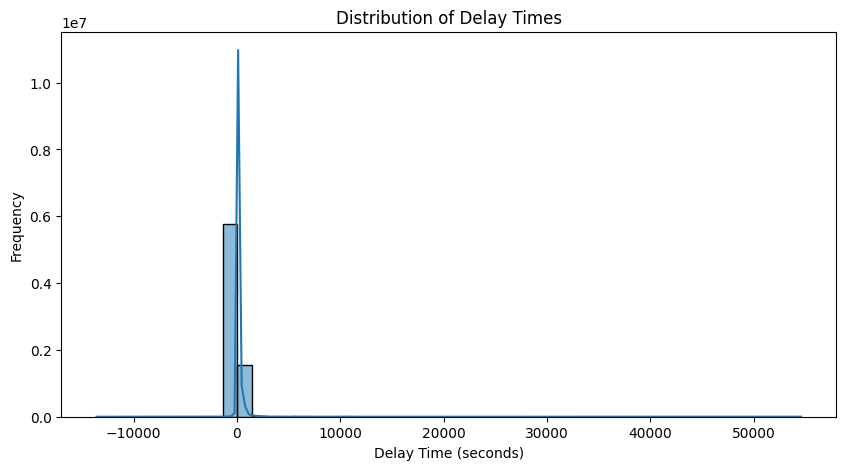
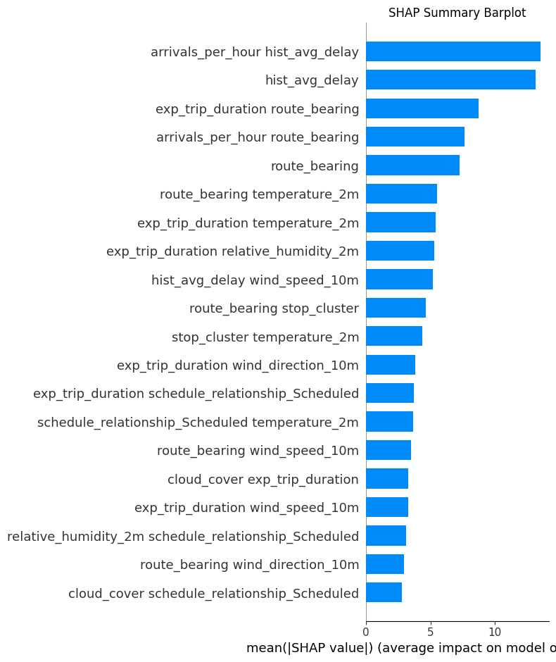

# STM Transit Delay Prediction

## Introduction

The _Société de transport de Montréal_ (STM) is Montreal’s public transport agency. The network contains four subway lines and 235 bus routes. The STM is one of the biggest transit systems in Canada and North America. Predicting these delays not only helps passengers plan their journeys more effectively but also enables STM to optimize scheduling and resource allocation.

## Description

The goal of this project is to build a machine learning model that predicts the STM transit delays in seconds with the best accuracy.

## Dataset

### Source

The data was collected from April 27<sup>th</sup> to May 8<sup>th</sup>. It comes from three different sources:

- [STM Bus Lines Web Page](https://www.stm.info/en/info/networks/bus): Route types collected with web scraping.
- [STM General Transit Feed Specification (GTFS)](https://www.stm.info/en/about/developers): Real-time trip updates and schedules fetched hourly.
- [Open-Meteo API](https://open-meteo.com/en/docs): Weather archive and forecast.

### Description

- The cleaned dataset contains a total of 7,530,892 rows and 27 columns.
- Here are some of the key features collected:
  - `rt_arrival_time`, `rt_departure_time`: Real-time arrival and departure time
  - `sch_arrival_time`, `sch_departure_time`: Scheduled arrival and departure time
  - `stop_sequence`: Sequence of a stop, for ordering
  - `stop_lat`, `stop_lon`: Stop coordinates
  - `temperature_2m`: Air temperature at 2 meters above ground
  - `relative_humidity_2m`: Relative humidity at 2 meters above ground
  - `wind_direction_10m`: Wind direction at 10 meters above ground
  - `wind_speed_10m`: Wind speed at 10 meters above ground

## Methods & Models

### Data Preprocessing

- Handle outliers:
  
  - There were extreme delay outliers of less than -13500 seconds (3 hours 45 minutes) and more than 55000 seconds (15 hours).
  - The delays that were greater of equal to the expected trip duration were removed, because it's most likely a cancelled trip or a rare event.
  - In order to preserve the right-skewed distribution, the negative delays equal or lesser than the quarter of the expected trip duration have been removed.
- Due to the large volume of data, half of the dataset has been used as historical data. The other half was used for data modeling.
- Temporal feature extraction was used for `day_of_week`, `hour`,`is_week_end` and `is_peak_hour`.

### Feature Engineering

- Average delay per stop per hour was calculated with the historical data.
- `time_of_day` categorical feature was created with `hour`.
- Other trip-based featured have been created like `trip_progression`, `exp_trip_duration` (expected trip duration), `stop_distance` (from previous stop), `arrivals_per_hour` and `route_bearing`.
- The stop coordinates have been grouped with K-Means clustering.
  

### Data splitting

- The train-validation-test split was 80-10-10.
- 25% of the train set has been used for faster experimenting. The full train size was used for the final model.
- In order to preserve the distribution in the sample, stratified sampling based on delay quantiles was applied.

### Models Tested

The following tree-based regression models have been tested in this project: **XGBoost**, **LightGBM** and **CatBoost**. They have been selected because they work great for high-cardinality, non-linear and mixed data. Also, they have a shorter fitting time for large datasets.

### Hyperparameter Tuning

To save computation time, a Randomized Search was performed with a 2-Fold Cross-Validation for each model instead of a Grid Search.

### Feature Optimization

Polynomial features have been generated and the best ones have been selected based on Mutual Information Regression.

### Evaluation Metrics

- Mean Average Error (MAE)
- Root Mean Squared Error (RMSE)
- Coefficient of Determination (R²)
- Feature Importances
- SHapley Additive exPlanations (SHAP) analysis for interpretability

## Results

### Metrics:

| Model    | MAE   | RMSE   | R²     |
| -------- | ----- | ------ | ------ |
| Baseline | 71.40 | 138.65 | 0.1959 |
| XGBoost  | 58.51 | 115.45 | 0.4521 |

### Key Visualizations:


- Prediction vs. Actual plot demonstrates a good fit for typical delay ranges.
- Residual plot shows increase of variance for higher predicted delays (heteroscedasticity) and systematic large delay underestimation.


- Feature Importance analysis reveals that **historical delay** and **arrivals per hour** are major predictors.

### Model Interpretability:

- SHAP analysis indicates that **historical average delay** and **arrivals per hour** are the most influential features.
  

## Future Improvements

- Integrate real-time traffic and incident reports for enhanced delay prediction.
- Integrate events (concerts, festivals, sports events).
- Integrate location of cycleways since it can slow down buses.
- Collect data for a full year and add other time-based features like `month` and `is_holiday`.
- Insert the data into a database to optimize performance.
- Explore time-series and deep-learning models.

## Conclusion

This project demonstrates the application of machine learning for predicting STM transit delays in real time. By leveraging historical transit data, weather information, and stop-level details, the XGBoost Regressor was able to achieve a **MAE of 58.51** and an **RMSE of 115.44**, significantly outperforming the baseline model. These results indicate that machine learning can serve as a powerful tool for optimizing public transit schedules and improving commuter experience.

The analysis identified key predictors such as **historical average delay**, **expected trip duration**, and **arrivals per hour** as the main drivers of delay, providing valuable insights into transit bottlenecks and congestion periods. Overall, this project not only highlights the feasibility of transit delay prediction but also sets a strong foundation for future enhancements that can benefit both STM operations and public transit users in Montreal.

## Featured Notebooks

- [Data Collection and Cleaning](./notebooks/data_cleaning.ipynb)
- [Data Preprocessing](./notebooks/data_preprocessing.ipynb)
- [Data Modeling](./notebooks/data_modeling.ipynb)

## Deployment

The STM Transit Delay Prediction model is deployed locally using a Flask API. This allows for real-time predictions of transit delays by making HTTP requests.

### How to Run:

1. **Clone the repository**

- Open your terminal or command prompt.
- Navigate to the directory where you want to install the project.
- Run the following command to clone the GitHub repository:
  ```bash
  git clone https://github.com/nadpierre/stm-transit-delay-prediction.git
  ```

2. **Create a virtual environment**

   ```bash
   cd stm-transit-delay-prediction
   python<version> -m venv <virtual-environment-name>
   ```

> [!NOTE]
> The python version used in this project is 3.13.

3. **Activate the virtual environment**

- Activate the virtual environment based on your operating system
  ```bash
  source <venv-folder>/bin/activate
  ```

4. **Install dependencies**

- Navigate to the project directory
  ```bash
  cd <project-directory>
  ```
- Run the following command to install project dependencies:
  ```bash
  pip install -r requirements.txt
  ```

5. **Import Data**

- Download the zip file from the [following link](https://drive.google.com/file/d/1eXAkEukoViIvppB9rGH-laS75mtNNgbr/view?usp=sharing).
- Extract the archive.
- Move the `data` directory to the root of the project.

6. **Create an environment file**

- Copy the file `.env-sample` and rename it `.env`

7. **Import custom python code**

   To avoid the following error `ModuleNotFoundError: No module named <directory_name>`, run the following commands:

   ```bash
   cd <project-directory>
   export PYTHONPATH="$PYTHONPATH:$PWD"
   ```

   You can also add the project path to your shell configuration file e.g. `$HOME/.bashrc`.

8. **Run the Flask application**

- Execute the following command in the root directory:
  ```bash
  python app.py
  ```
- Open a web browser to `http://127.0.0.1:5000`.

### API Endpoint

- **`POST /get-directions`**

  - **Description** Accepts JSON input with a bus number and returns the directions.
  - **Example CURL Request:**
    ```bash
    curl -H "Content-type: application/json" \
    -d '{"bus_line": "13"}' \
    -X POST \
    http://127.0.0.1:5000/get-directions
    ```
  - **Example Response:**
    ```json
    [
      {
        "direction_en": "North",
        "direction_fr": "Nord"
      },
      {
        "direction_en": "South",
        "direction_fr": "Sud"
      }
    ]
    ```

- **`POST /get-stops`**

  - **Description:** Accepts JSON input with bus line and direction and returns all the associated bus stops.
  - **Example CURL Request:**
    ```bash
    curl -H "Content-type: application/json" \
    -d '{"bus_line": "161", "direction": "Est"}' \
    -X POST \
    http://127.0.0.1:5000/get-stops
    ```
  - **Example Response:**

    <sub>_Only the first and last few stops are shown for brevity._</sub>

    ```json
    [
      {
        "stop_id": 56338,
        "stop_name": "Kildare / Westminster",
        "stop_sequence": 1
      },
      {
        "stop_id": 56345,
        "stop_name": "Kildare / McMurray",
        "stop_sequence": 2
      },
      {
        "stop_id": 56348,
        "stop_name": "Kildare / Melling",
        "stop_sequence": 3
      },
      {
        "stop_id": 51423,
        "stop_name": "Van Horne / Jeanne-Mance",
        "stop_sequence": 43
      },
      {
        "stop_id": 51449,
        "stop_name": "Van Horne / Waverly",
        "stop_sequence": 44
      },
      {
        "stop_id": 51648,
        "stop_name": "Station Rosemont (Rosemont / De Saint-Vallier)",
        "stop_sequence": 45
      }
    ]
    ```

- **`POST /predict`**

  - **Description:** Accepts form input with model features and returns the predicted arrival time, historical average delay weather condition.
  - **Example CURL Request:**
    ```bash
    curl -H "Content-type: application/x-www-form-urlencoded" \
    -d "bus_line=30" \
    -d "direction=Nord" \
    -d "stop=61153" \
    -d "chosen_time=2025-05-18T11:48" \
    -X POST \
    http://127.0.0.1:5000/predict
    ```
  - **Example Response:**
    ```json
    {
      "hist_avg_delay": -1,
      "next_arrival_time": "2025-05-18 12:15",
      "predicted_time": "2025-05-18 12:15",
      "status": "On Time",
      "temperature": 17.7,
      "weather_condition": "Overcast"
    }
    ```

### Monitoring and Logging

The application uses Python's built-in `logging` module for structured logging. The log levels used are `DEBUG`, `INFO` and `ERROR`.
Logs are stored in the file `stm_api_errors.log` at the root of the project.

Example of a log entry:

```log
2025-05-17 22:04:38 root [INFO] /predict - Route: 47 | Direction: Ouest | Stop: 52419 | Time: 2025-05-17T21:49 | Delay: 40.76
```

### API Key Setup

To run the script `fetch_stm_trip_updates.py` you need an API key from the STM Developer Hub.

1. Get API key:

- Visit this [STM page](https://www.stm.info/en/about/developers/faq-new-api-hub)
- Follow the instructions to create and account and obtain your API key.

2. Set up API key:

- In the `.env` file, replace the values with your actual API key.
  ```bash
  STM_API_KEY="your_stm_api_key_here"
  ```

## References

- [STM Bus network and schedules explained](https://www.stm.info/en/info/networks/bus-network-and-schedules-enlightened)
- [Official GTFS Documentation](https://gtfs.org/documentation/overview/)
- [GTFS Repository](https://github.com/google/transit/blob/master/gtfs/spec/en/reference.md)
